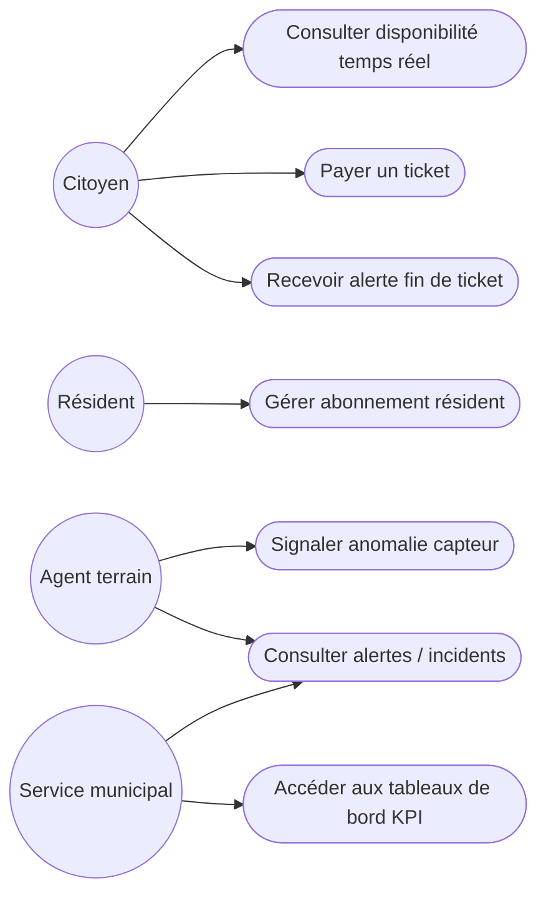
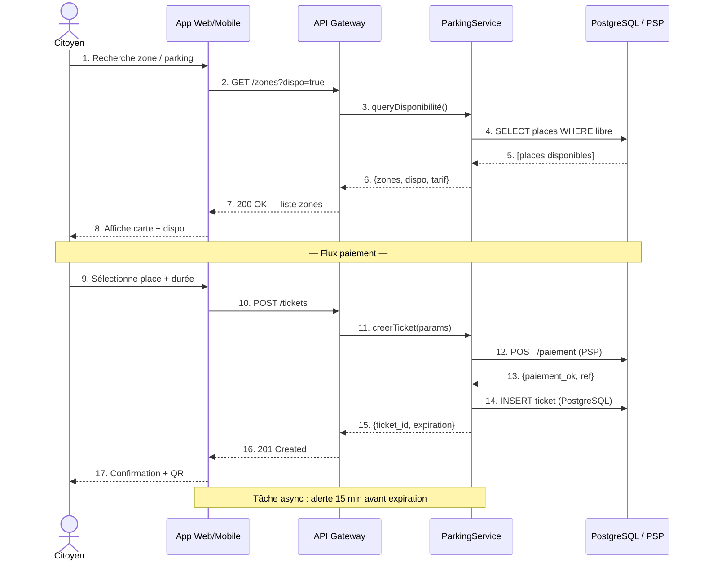
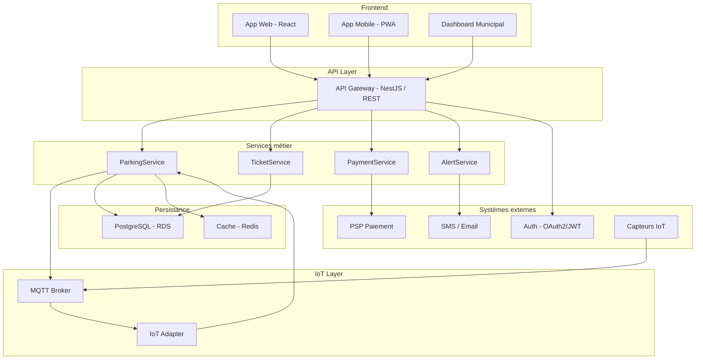
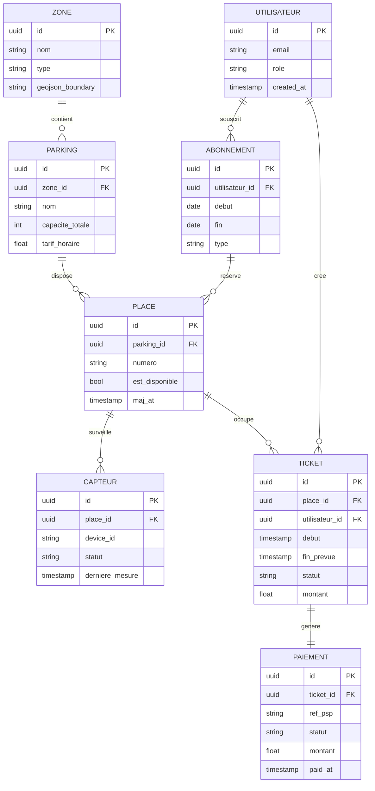

# EC01.3 – Note de cadrage
## Projet : Ville Intelligente

---

## 1. Synthèse des décisions

| # | Décision | Choix retenu | Justification |
|---|----------|-------------|---------------|
| D1 | Style d'architecture | Monolithe modulaire en V1 (couches) | Compromis maintenabilité / coût ; microservices différés en V2 |
| D2 | Protocole IoT | MQTT (broker Mosquitto / AWS IoT Core) | Légèreté, faible bande passante, standard industriel capteurs |
| D3 | Authentification | JWT stateless (usagers) + OAuth2/SSO (agents) | Séparation des populations ; scalabilité stateless |
| D4 | Hébergement | Cloud AWS (ECS + RDS PostgreSQL) | On-premise exclu en V1 (coût/délai déploiement) |
| D5 | Conformité RGPD | Aucune donnée de localisation personnelle persistée sans consentement | Obligation légale ; données paiement déléguées au PSP |
| D6 | Frontend | React (Web) + PWA (Mobile) | Partage de code, offline partiel, déploiement simplifié |
| D7 | Cache | Redis (lecture disponibilité temps réel) | SLA ≤ 2 s sur consultation ; soulage PostgreSQL |

---

## 2. Diagramme de cas d'utilisation

> Légende couleur MoSCoW — Bleu : Must · Vert : Should · Amber : Reporting · Coral : Agent

---

## 3. Diagramme de séquence — Consultation + Paiement (flux principal)

---

## 4. Diagramme de composants

---

## 5. Modèle de données (ERD)

---

## 6. Tableau des tests TDD

> Couverture : 16 scénarios · 7 fonctionnalités · 4 types (Normal / Limite / Erreur / Performance)

| ID | Fonctionnalité | Type | Scénario | Données d'entrée | Résultat attendu | Critère ✓ (PASS) | Critère ✗ (FAIL) |
|----|---------------|------|----------|-----------------|-----------------|-----------------|-----------------|
| T01 | Consultation disponibilité | Normal | Zone existante avec places libres | zone_id valide, horodatage courant | HTTP 200 + liste places disponibles | ≥ 1 place retournée, statut libre | 200 vide ou erreur 5xx |
| T02 | Consultation disponibilité | Limite | Zone saturée (0 place libre) | zone_id avec capacité = 0 | HTTP 200 + tableau vide + flag "complet" | 200 + liste vide + flag saturé | Erreur 404 ou 5xx |
| T03 | Consultation disponibilité | Erreur | zone_id inexistant | zone_id = "xxx-invalide" | HTTP 404 + message d'erreur clair | 404 + body JSON `{error: "zone_not_found"}` | 500 ou réponse vide |
| T04 | Paiement ticket | Normal | Paiement CB valide, place libre | place_id dispo, durée 2h, carte valide | HTTP 201 + ticket créé + ref_psp | 201, ticket_id généré, statut = actif | Ticket créé sans paiement confirmé |
| T05 | Paiement ticket | Erreur | Refus PSP (carte refusée) | place_id dispo, carte refusée | HTTP 402 + aucun ticket créé | 402, aucune ligne en base | Ticket créé malgré refus PSP |
| T06 | Paiement ticket | Limite | Place déjà occupée au moment du paiement (race condition) | place_id non dispo | HTTP 409 + message "place_unavailable" | 409 + rollback paiement | Double occupation ou 500 |
| T07 | Alerte fin de ticket | Normal | Ticket expirant dans 15 min | ticket_id, fin_prevue = now + 15 min | SMS/email envoyé à l'utilisateur | Notification envoyée, log enregistré | Aucune notification ou doublon |
| T08 | Alerte fin de ticket | Limite | Ticket déjà clôturé avant alerte | ticket_id statut = clos | Aucune notification émise | 0 message envoyé | Notification émise sur ticket clos |
| T09 | Mise à jour capteur IoT | Normal | Capteur envoie statut "libre" | MQTT topic capteur/place_id, payload = `{libre}` | Place mise à jour en base < 1 s | est_disponible = true en BDD < 1 s | Place reste occupée ou délai > 5 s |
| T10 | Mise à jour capteur IoT | Erreur | Capteur envoie données corrompues | Payload malformé (JSON invalide) | Message ignoré, log d'anomalie créé | Erreur loggée, place inchangée | Exception non gérée / crash service |
| T11 | Gestion abonnement | Normal | Résident souscrit un abonnement mensuel | utilisateur_id, type = mensuel, place réservée | HTTP 201 + abonnement actif | 201, dates cohérentes, place réservée | Abonnement créé sans place associée |
| T12 | Gestion abonnement | Limite | Abonnement sur place déjà réservée | place_id déjà associée à un abonnement actif | HTTP 409 conflit | 409 + message explicite | Double réservation acceptée |
| T13 | Tableau de bord KPI | Normal | Agent municipal consulte taux d'occupation | zone_id, période = 7 derniers jours | HTTP 200 + taux occupation + recettes | 200, valeurs numériques cohérentes | Données vides ou incohérentes |
| T14 | Authentification | Erreur | Token JWT expiré ou invalide | Authorization: Bearer token_expiré | HTTP 401 Unauthorized | 401, aucune donnée retournée | Accès accordé malgré token invalide |
| T15 | Performance — disponibilité | Performance | 50 requêtes simultanées GET /zones | 50 users concurrents, charge normale | P95 ≤ 2 s, 0 erreur 5xx | P95 < 2 s, taux erreur < 0,1 % | P95 > 2 s ou ≥ 1 erreur 5xx |
| T16 | Performance — paiement | Performance | 20 paiements simultanés POST /tickets | 20 users concurrents, places différentes | 0 double occupation, P95 ≤ 3 s | Atomicité garantie, P95 < 3 s | Double occupation ou timeout |

---

## 7. Traçabilité bout-en-bout P1 → P3

| Élément P3 | Source P1 | Décision P2 |
|-----------|----------|------------|
| Cas d'usage (7 UC) | §4 Exigences fonctionnelles + §6 MoSCoW | D1 périmètre V1 |
| Séquence consultation/paiement | §8 Architecture logique + §10 Choix techno | D2 MQTT, D3 JWT, D5 RGPD |
| Composants (5 couches) | §8 Architecture + §9 Contraintes techniques | D1 couches, D6 React/PWA, D7 Redis |
| ERD (8 entités) | §3 Besoins + §5 Exigences NF (RGPD) | D5 données personnelles isolées |
| Tests T15/T16 | §5 SLA ≤ 2 s (NF) | D4 Cloud AWS + D7 Redis |
| Tests T04/T05/T06 | §4 Paiement (Must) | D5 PSP délégué, atomicité |
| Tests T09/T10 | §4 Capteurs IoT (Must) | D2 MQTT broker |

---

